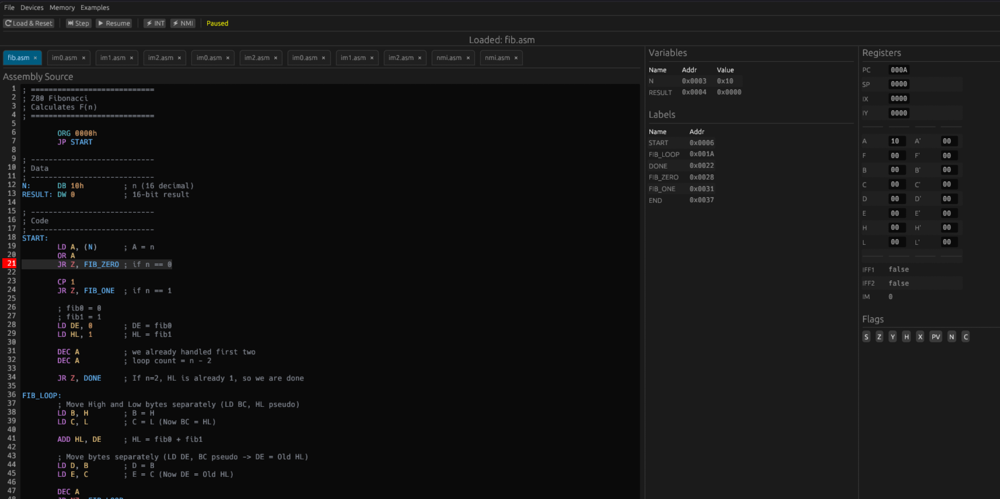

<div align="center">

# 🎷 JAZZ80
### *Just Another Zilog Z80*

A **Zilog Z80 CPU simulator, editor and debugger** written in Rust, built on top of [`egui`](https://github.com/emilk/egui) / [`eframe`](https://github.com/emilk/eframe). Write or load Z80 assembly, step through it instruction by instruction, and watch every register, flag and memory cell update in real time — as a native desktop app, or entirely in the browser via WebAssembly.

<!-- Add a screenshot or GIF of the simulator here, e.g.:  -->




<div align="center">

[](https://github.com/migouche/simulador-z80/blob/master/LICENSE)
[](https://github.com/migouche/simulador-z80/releases)
[](https://github.com/migouche/simulador-z80/actions)


</div>

</div>

---

## About

JAZZ80 started life as a Bachelor's Thesis (*Trabajo de Fin de Grado*) at Universidad Rey Juan Carlos and grew into a full simulation environment for the [Zilog Z80](https://en.wikipedia.org/wiki/Zilog_Z80) — the 8-bit CPU behind machines like the ZX Spectrum and the MSX. It's aimed at students, retrocomputing hobbyists and anyone who wants to see exactly what a Z80 program does, one instruction at a time, without wiring up real hardware.

## Features

- 🎯 **Full instruction set** — every official Z80 opcode plus the undocumented `DDCB`/`FDCB` variants
- 👽 **Undocumented behavior** — all the quirks and edge cases of the Z80's flags, registers and instructions (*hopefuly*) faithfully reproduced
- 🐞 **Step-by-step debugging** — run, pause, single-step, and set breakpoints anywhere in your code
- 🔁 **Interrupts** — all three interrupt modes (IM 0/1/2) and NMIs, with dedicated buttons to trigger them on demand
- 🧠 **Live CPU state** — inspect and hand-edit every register, including the shadow register set (`AF'`, `BC'`, `DE'`, `HL'`)
- 🗺️ **Memory view** — browse and edit simulator memory directly
- 🎨 **Built-in editor** — syntax highlighting inspired by the One Dark theme
- 💾 **Persistence** — save and reload programs, with session state preserved between runs
- 🌐 **Runs anywhere** — a native desktop app on Windows/macOS/Linux, or a self-contained WebAssembly build that runs in any modern browser
- 🧪 **Tested** — covered by an automated test suite (`rstest` + `egui_kittest`) with coverage tracked in CI

## Milestones

A quick look at how JAZZ80 got here — see the [Releases page](https://github.com/migouche/simulador-z80/releases) for the full changelog.

| Version | Highlights |
|---|---|
| 0.1.x | Editor with syntax highlighting, breakpoints, file save/load, persistent state |
| 0.2.0 | Full interrupt support — IM 0/1/2, NMIs, `IN`/`OUT`, block instructions |
| 0.3.0 | WebAssembly target — runs entirely in the browser |
| 0.4.0 | Complete official + undocumented instruction set |
| 0.4.1 – 0.4.3 | Trait-based operand/addressing refactor, live memory view, register & shadow-register editing, one-click interrupt/NMI triggers |

## Getting Started

### Prerequisites

- [Rust](https://www.rust-lang.org/tools/install) for 2024 edition (stable)

### Run natively

```bash
git clone https://github.com/migouche/simulador-z80.git
cd simulador-z80
cargo run --release # release build is faster, but will take longer to compile
```

### Run in the browser
The project is hosted on GitHub Pages at [https://migouche.github.io/simulador-z80/](https://migouche.github.io/simulador-z80/), but you can also run it locally.

The web build uses [Trunk](https://trunkrs.dev/) to compile and bundle the app as WebAssembly:

```bash
cargo install --locked trunk
rustup target add wasm32-unknown-unknown

trunk serve
```

Then open the address Trunk prints (typically `http://127.0.0.1:8080`). The bundled example programs in [`z80 files/`](./z80%20files) ship with the web build, so you can try the simulator without loading anything of your own first.

To produce a static, deployable build (e.g. for GitHub Pages or any static host):

```bash
trunk build --release
```

## Usage

1. Write or open a Z80 assembly program in the built-in editor.
2. Set breakpoints on the lines you care about.
3. Run or single-step through execution while registers, flags and memory update live. No need to save to run!
4. Trigger an interrupt (IM 0/1/2) or an NMI at any point using the toolbar controls.
5. Inspect or manually edit any register, shadow register, or memory cell mid-run.
6. Save your program and pick up where you left off later — the app persists session state between runs.

## Testing

```bash
cargo test
```

The test suite combines [`rstest`](https://github.com/la10736/rstest) for parameterized CPU/instruction tests with [`egui_kittest`](https://github.com/emilk/egui) for exercising the UI itself. Coverage is measured in CI and published as the badge at the top of this file.

## Contributing

Contributions are welcome — whether that's a bug report, a fix for an instruction/flag edge case, or a new feature. The Z80's undocumented behavior is notoriously fiddly, so reports that pinpoint a specific opcode, flag, or addressing mode against real hardware or a trusted reference are especially useful. So if you find a bug, please open an issue with a minimal reproduction case or:

1. Fork the repository
2. Create a branch for your change
3. Make sure `cargo test` passes
4. Open a pull request describing what changed and why

## Acknowledgments

- [Zilog](https://en.wikipedia.org/wiki/Zilog_Z80) for the original Z80, and the wider retrocomputing community for decades of documentation on its undocumented corners
- [z80.info](http://www.z80.info/) as a long-standing community reference for Z80 development
- The [`egui`/`eframe`](https://github.com/emilk/egui) and [Trunk](https://trunkrs.dev/) projects, which make a single Rust codebase run as both a native app and a web app
- Universidad Rey Juan Carlos, where this project began as a Bachelor's Thesis